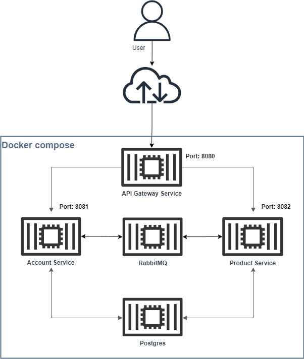
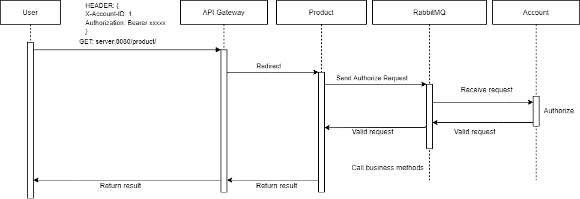
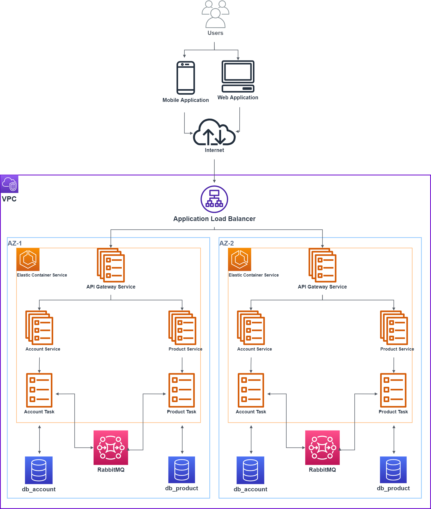

## Description
This is an example for building an microservices application with multi-tenancy in Java 11 using Spring boot, Docker and RabbitMQ with Postgres as our database.

We will provide the multi-tenancy by "schema" level in our Postgres database. 

Every schema is the same in the config as well as the structure, only differs in the data between them.

The projects are secured by using spring security and the requests are authorized by using JWT.

In this example, we will have these maven projects:

1. **parent**: This is where our maven dependencies are declared, other services will extends the **parent**'s pom file to avoid duplicating declaration.

2. **common**: This is where our DTOs are located, these are the classes that will be accessed among other services to exchange messages via RabbitMQ. This is also the place for the configurations that will be used by the extended projects.

3. **account**: This is where we will manage the accounts in our application, it will also handle the authentication as well as authorization. 

4. **product**: This is the multi-tenancy project that manages the products.

## How it works

This is the basic diagram of how everything interacts with each other:



Here is the example of a GET request to `server:8080/product/`: 



Here is the overview when deployed to AWS:




## Prerequisite

1. Java 11, Hibernate 5, Spring boot 2.6.7, Postgresql 14, Maven > 3.8.1, Docker, Spring Security, Spring Cloud Gateway, Swagger 3.0 (OpenAPI 3.0).
2. Docker compose installed

## Building and running project
We will be using docker-compose to run all of the service:

1. Start from the  root and run `build-code.bat`:
``` bash
./build-code.bat
```
2. After it's finished, run docker compose:
``` bash
docker compose up --build
```
3. To stop press Ctrl + C 
4. To shutdown, run:
``` bash
docker compose down
```
## Database generation
We will use the @Entity annotation to make Hibernate auto generates and updates the tables for us.

## Project Configuration

We will be using application.yaml file to config our project:
``` yaml
#account/src/main/resources/application.yaml
#local profile ( run with mvn spring-boot:run or run as Java application)
server:
  port: 8081
  tomcat:
    connection-timeout: 900s
  error:
    include-stacktrace: ON_PARAM
spring:
  liquibase:
    enabled: false
  application:
    name: account-service  
  datasource:
    url: jdbc:postgresql://localhost:5432/db_account
    username: ad
    password: 12345678!Ad
  jpa:
    properties:
      hibernate:
        dialect: org.hibernate.dialect.PostgreSQLDialect
    show-sql: false
    generate-ddl: true
    hibernate:
      ddl-auto: update     
  rabbitmq:
    host: host.docker.internal 
    username: ad
    password: 12345678!Ad
    port: 5672
springdoc:
   swagger-ui:
      path: /api/docs/swagger-ui.html
---
spring:
  datasource:
    url: jdbc:postgresql://host.docker.internal:5432/db_account
  config:
    activate:
      on-profile: dev
```

## Lombok

We will use the lombok plugin, we will include it in the pom.xml:

``` xml
<plugin>
    <groupId>org.springframework.boot</groupId>
    <artifactId>spring-boot-maven-plugin</artifactId>
    <configuration>
        <excludes>
            <exclude>
                <groupId>org.projectlombok</groupId>
                <artifactId>lombok</artifactId>
            </exclude>
        </excludes>
    </configuration>
</plugin>
```
